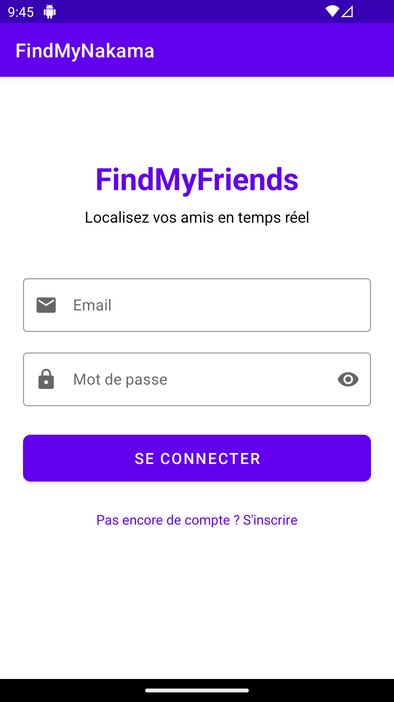
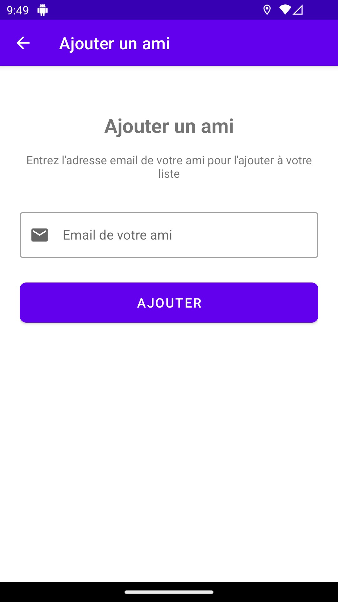
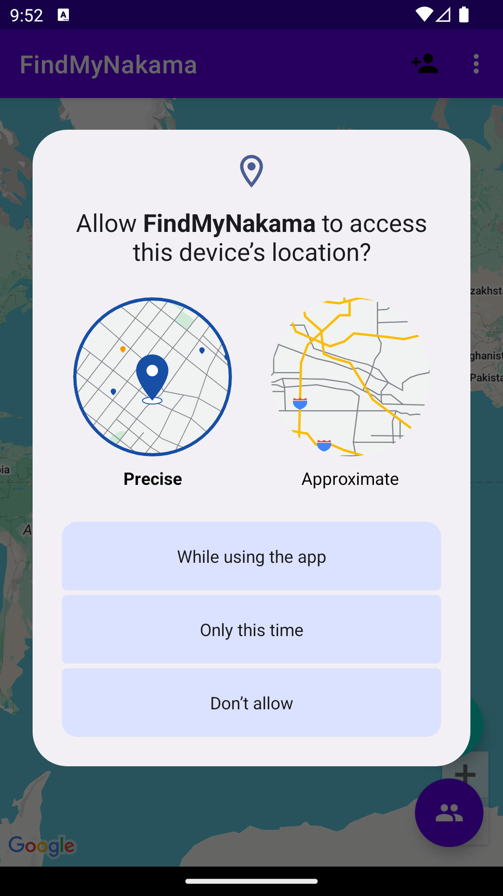
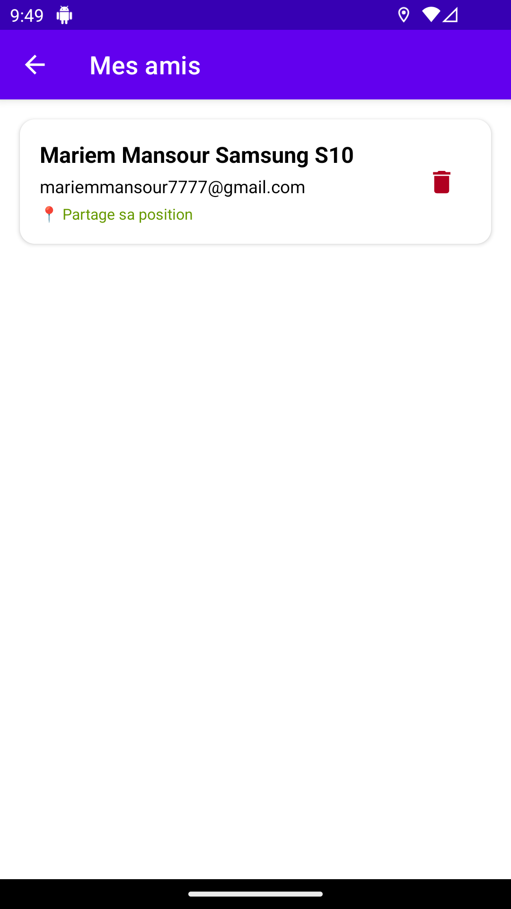
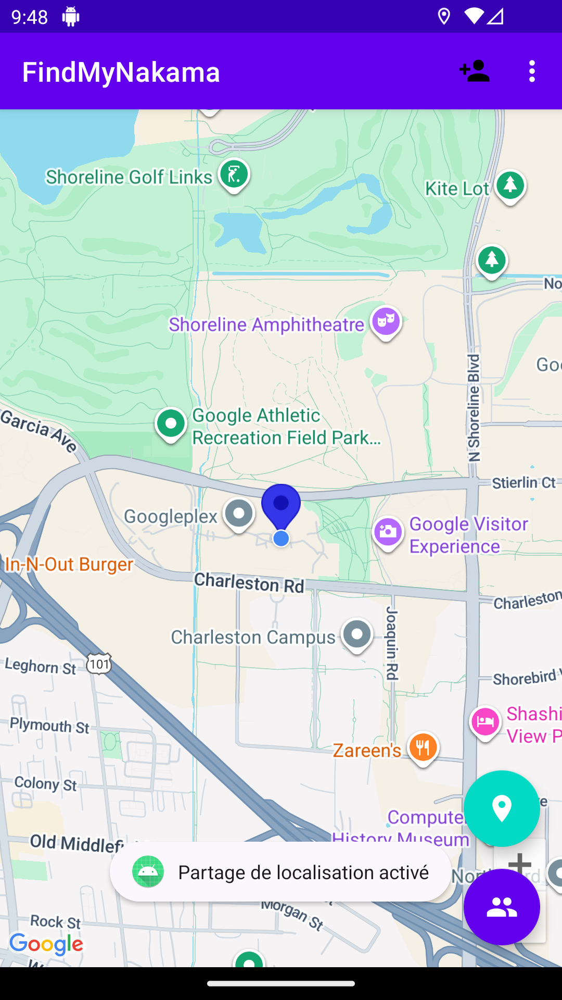
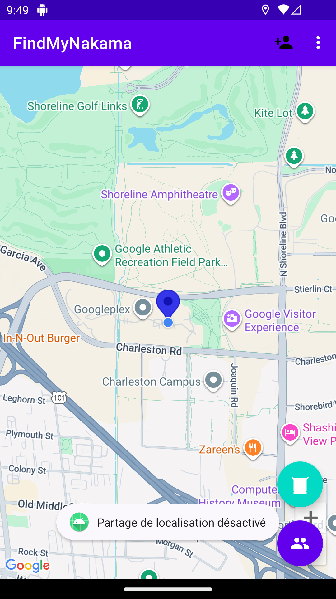
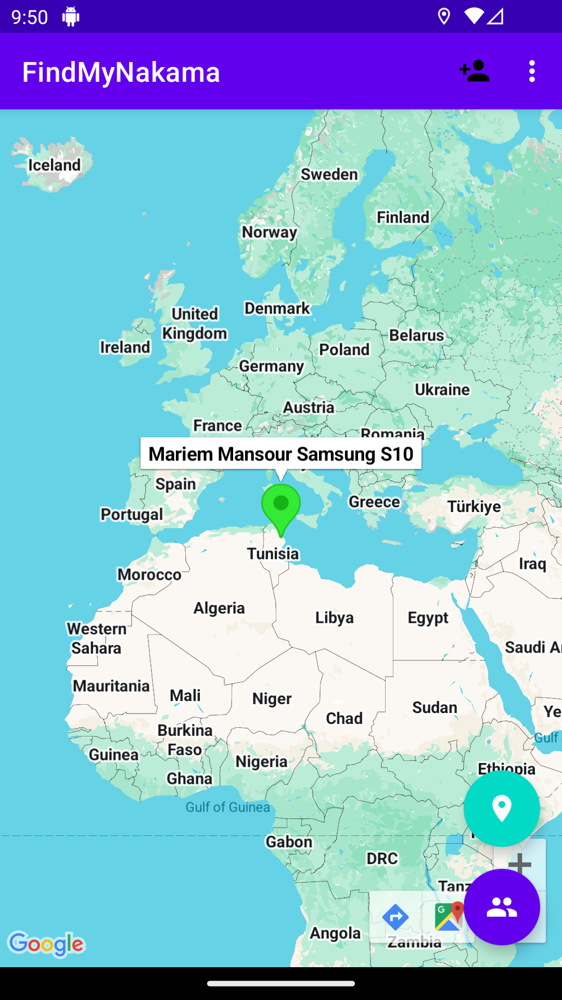

# 📱 FindMyNakama - Live Tracking System

[](https://www.android.com/)
[](https://www.java.com/)
[](https://firebase.google.com/)
[](https://developers.google.com/maps)
[](LICENSE)

> **FindMyNakama** (なかま = "friends" in Japanese) is a real-time location tracking Android application that allows you to share your location with friends and see their positions on an interactive map.

---

## 📋 Table of Contents

- [✨ Features](#-features)
- [🎥 Demo](#-demo)
- [🏗️ Architecture](#️-architecture)
- [🚀 Getting Started](#-getting-started)
  - [Prerequisites](#prerequisites)
  - [Installation](#installation)
  - [Firebase Setup](#firebase-setup)
  - [Google Maps Setup](#google-maps-setup)
- [📱 App Structure](#-app-structure)
- [🔧 Technologies Used](#-technologies-used)
- [📸 Screenshots](#-screenshots)
- [🎯 Usage](#-usage)
- [🔐 Security](#-security)
- [🐛 Troubleshooting](#-troubleshooting)
- [🤝 Contributing](#-contributing)
- [📄 License](#-license)
- [👥 Authors](#-authors)
- [🙏 Acknowledgments](#-acknowledgments)

---

## ✨ Features

### 🔐 Authentication
- **Email/Password Registration** - Secure user registration with Firebase Authentication
- **Login/Logout** - Persistent session management
- **User Profile Storage** - Store user information in Firestore

### 🗺️ Real-Time Location Tracking
- **Live GPS Tracking** - Updates every 10 seconds
- **Google Maps Integration** - Interactive map with custom markers
- **Blue Marker (You)** - Your current position with auto-centering
- **Green Markers (Friends)** - Real-time friend locations
- **Toggle Location Sharing** - Enable/disable sharing with one tap

### 👥 Friend Management
- **Add Friends by Email** - Simple friend request system
- **Friends List** - View all friends with sharing status
- **Remove Friends** - Bilateral friend removal
- **Real-Time Status** - See who's currently sharing their location

### 🎨 Modern UI/UX
- **Material Design 3** - Clean and intuitive interface
- **Floating Action Buttons** - Quick access to key features
- **RecyclerView** - Smooth scrolling friend list
- **Loading Indicators** - User feedback for all operations

---

## 🎥 Demo

### App Workflow

```
Login → Register → Main Map → Add Friends → Track Locations → Logout
```

### Key Interactions

1. **First Time User**: Register → Verify Email → Main Map
2. **Adding Friends**: Menu → Add Friend → Enter Email → Friend Added
3. **Tracking**: Enable Sharing → Friend's Green Marker Appears
4. **Stop Tracking**: Disable Sharing → Your Marker Disappears for Friends

---

## 🏗️ Architecture

### MVC Pattern

```
┌─────────────────────────────────────────────────┐
│                   VIEW LAYER                     │
│  ┌──────────────┐  ┌──────────────┐            │
│  │ XML Layouts  │  │   Activities │            │
│  └──────────────┘  └──────────────┘            │
└─────────────────────────────────────────────────┘
                        ↕
┌─────────────────────────────────────────────────┐
│                 CONTROLLER LAYER                 │
│  ┌──────────────┐  ┌──────────────┐            │
│  │  Activities  │  │   Adapters   │            │
│  └──────────────┘  └──────────────┘            │
└─────────────────────────────────────────────────┘
                        ↕
┌─────────────────────────────────────────────────┐
│                   MODEL LAYER                    │
│  ┌──────────────┐  ┌──────────────┐            │
│  │   Firebase   │  │   Location   │            │
│  │  Firestore   │  │   Services   │            │
│  └──────────────┘  └──────────────┘            │
└─────────────────────────────────────────────────┘
```

### Data Flow

```
GPS Sensor → FusedLocationProvider → LocationCallback
                                            ↓
                                   MainActivity
                                            ↓
                               ┌────────────┴────────────┐
                               ↓                         ↓
                        Update Map Marker      Upload to Firestore
                               ↓                         ↓
                        Blue Marker                Friends' Devices
                                                         ↓
                                                  Green Markers
```

### Firestore Data Structure

```
users/
  ├── {userId}/
  │     ├── name: "John Doe"
  │     ├── email: "john@example.com"
  │     ├── sharingLocation: true/false
  │     ├── latitude: 48.8566
  │     ├── longitude: 2.3522
  │     ├── timestamp: 1234567890
  │     ├── createdAt: 1234567890
  │     └── friends: {
  │           {friendId1}: true,
  │           {friendId2}: true
  │         }
  └── ...
```

---

## 🚀 Getting Started

### Prerequisites

- **Android Studio** Hedgehog | 2023.1.1 or later
- **JDK** 8 or higher
- **Android SDK** API 24+ (Android 7.0 Nougat)
- **Google Account** for Firebase and Maps API
- **Physical Device** or Emulator with Google Play Services

### Installation

1. **Clone the repository**

```bash
git clone https://github.com/mariem1mansour/FindMyNakama_LiveTrackingSystem_Java_Android_MobileApp.git
cd FindMyNakama_LiveTrackingSystem_Java_Android_MobileApp
```

2. **Open in Android Studio**

```
File → Open → Select the project folder
```

3. **Wait for Gradle Sync**

Android Studio will automatically download all dependencies.

---

### Firebase Setup

#### Step 1: Create Firebase Project

1. Go to [Firebase Console](https://console.firebase.google.com/)
2. Click **"Add project"**
3. Enter project name: `FindMyNakama`
4. Follow the setup wizard

#### Step 2: Add Android App to Firebase

1. In Firebase Console, click **Android icon**
2. **Android package name**: `com.example.findmyfriends`
3. **App nickname**: `FindMyNakama` (optional)
4. **Debug signing certificate SHA-1**: (optional for now)
5. Click **"Register app"**

#### Step 3: Download google-services.json

1. Download the `google-services.json` file
2. Place it in: `app/google-services.json`

```
FindMyNakama/
├── app/
│   ├── google-services.json  ← HERE
│   └── build.gradle
└── ...
```

#### Step 4: Enable Authentication

1. In Firebase Console, go to **Authentication**
2. Click **"Get Started"**
3. Select **"Email/Password"**
4. Click **"Enable"**
5. Save

#### Step 5: Create Firestore Database

1. In Firebase Console, go to **Firestore Database**
2. Click **"Create database"**
3. Start in **test mode** (for development)
4. Select closest region
5. Click **"Enable"**

**Test Mode Rules** (for development only):
```javascript
rules_version = '2';
service cloud.firestore {
  match /databases/{database}/documents {
    match /{document=**} {
      allow read, write: if request.time < timestamp.date(2025, 12, 31);
    }
  }
}
```

⚠️ **Important**: Change to production rules before launching!

---

### Google Maps Setup

#### Step 1: Enable Maps SDK

1. Go to [Google Cloud Console](https://console.cloud.google.com/)
2. Select your Firebase project
3. **APIs & Services → Library**
4. Search for **"Maps SDK for Android"**
5. Click **"Enable"**

#### Step 2: Create API Key

1. **APIs & Services → Credentials**
2. Click **"Create Credentials"**
3. Select **"API key"**
4. Copy the API key

#### Step 3: Restrict API Key (Recommended)

1. Click on the API key name
2. **Application restrictions**:
   - Select **"Android apps"**
   - Add package name: `com.example.findmyfriends`
   - Add SHA-1 fingerprint (get with `./gradlew signingReport`)
3. **API restrictions**:
   - Select **"Restrict key"**
   - Check **"Maps SDK for Android"**
4. Save

#### Step 4: Add API Key to AndroidManifest.xml

Open `app/src/main/AndroidManifest.xml` and replace:

```xml
<meta-data
    android:name="com.google.android.geo.API_KEY"
    android:value="YOUR_GOOGLE_MAPS_API_KEY_HERE" />
```

With your actual key:

```xml
<meta-data
    android:name="com.google.android.geo.API_KEY"
    android:value="AIzaSyXXXXXXXXXXXXXXXXXXXXXXXXXXXXXX" />
```

---

### Build and Run

1. **Connect a device** or start an emulator
2. Click **"Run"** (green play button) or press `Shift + F10`
3. Grant location permissions when prompted
4. Create an account and start tracking!

---

## 📱 App Structure

```
app/src/main/java/com/example/findmyfriends/
├── LoginActivity.java              # User login screen
├── RegisterActivity.java           # User registration screen
├── MainActivity.java               # Main map screen with tracking
├── AddFriendActivity.java          # Add friend by email screen
└── FriendsListActivity.java        # View and manage friends list

app/src/main/res/
├── layout/
│   ├── activity_login.xml          # Login UI
│   ├── activity_register.xml       # Registration UI
│   ├── activity_main.xml           # Main map UI
│   ├── activity_add_friend.xml     # Add friend UI
│   ├── activity_friends_list.xml   # Friends list UI
│   └── item_friend.xml             # Single friend item layout
├── menu/
│   └── main_menu.xml               # Options menu
├── drawable/
│   ├── ic_*.xml                    # All vector icons
└── values/
    ├── strings.xml                 # String resources
    ├── colors.xml                  # Color palette
    └── themes.xml                  # App theme
```

---

## 🔧 Technologies Used

### Core Technologies

| Technology | Version | Purpose |
|------------|---------|---------|
| **Java** | 8+ | Programming language |
| **Android SDK** | API 24+ | Android framework |
| **Gradle** | 8.2.0 | Build system |

### Key Libraries

| Library | Version | Purpose |
|---------|---------|---------|
| **Firebase Auth** | 32.7.0 | User authentication |
| **Cloud Firestore** | 32.7.0 | Real-time database |
| **Google Maps** | 18.2.0 | Map display |
| **Play Services Location** | 21.1.0 | GPS location services |
| **Material Components** | 1.11.0 | UI components |
| **ConstraintLayout** | 2.1.4 | Layout management |

### Dependencies

```gradle
// Firebase
implementation platform('com.google.firebase:firebase-bom:32.7.0')
implementation 'com.google.firebase:firebase-auth'
implementation 'com.google.firebase:firebase-firestore'

// Google Maps & Location
implementation 'com.google.android.gms:play-services-maps:18.2.0'
implementation 'com.google.android.gms:play-services-location:21.1.0'

// UI
implementation 'com.google.android.material:material:1.11.0'
implementation 'androidx.constraintlayout:constraintlayout:2.1.4'
```

---

## 📸 Screenshots
### 1. Login Screen
Sign in to access your account and start tracking.


### 2. Register Screen
Create a new account to join the network.


### 3. Add Friend
Search and add friends by email or username.


### 4. Allow Location Permission
Grant location permissions to enable real-time tracking.


### 5. Friends List
View your list of connected friends.


### 6. Share Your Location
Toggle sharing your live location with selected friends.


### 7. Stop Sharing Your Location
Pause location sharing anytime for privacy.


### 8. View Friend's Location
See your friend’s live position on the map.


### 9. View Your Own Location
Check where you are on the map.


---

## 🎯 Usage

### First Time Setup

1. **Launch the app**
2. **Create account**:
   - Tap "Sign Up"
   - Enter name, email, password
   - Tap "Register"
3. **Grant permissions**:
   - Allow location access
   - Select "While using the app" or "Always"

### Adding Friends

1. **Tap the "+" button** (bottom right)
2. **Enter friend's email**
3. **Tap "Add"**
4. Friend is automatically added (no approval needed)

### Tracking Friends

1. **You must enable sharing** (tap location button)
2. **Friend must also enable sharing**
3. **Green marker appears** on your map
4. Marker updates automatically every 10 seconds

### Viewing Friend List

1. **Tap menu (⋮)** top right
2. **Select "My Friends"**
3. View all friends with status:
   - 📍 = Currently sharing location
   - ⭕ = Not sharing location

### Removing Friends

1. Go to **"My Friends"**
2. **Tap trash icon** on friend's card
3. **Confirm deletion**
4. Friend is removed from both sides

### Logging Out

1. **Tap menu (⋮)** top right
2. **Select "Logout"**
3. Returns to login screen

---

## 🔐 Security

### Current Implementation (Development)

⚠️ **Warning**: The current Firestore rules are permissive for development.

```javascript
// DEVELOPMENT ONLY - DO NOT USE IN PRODUCTION
allow read, write: if request.time < timestamp.date(2025, 12, 31);
```

### Production Rules (Recommended)

```javascript
rules_version = '2';
service cloud.firestore {
  match /databases/{database}/documents {
    // Users collection
    match /users/{userId} {
      // Users can only read their own data and data of their friends
      allow read: if request.auth != null;
      
      // Users can only write their own data
      allow write: if request.auth != null && request.auth.uid == userId;
      
      // Validate location sharing
      allow update: if request.auth != null 
                    && request.auth.uid == userId
                    && request.resource.data.sharingLocation is bool
                    && request.resource.data.latitude is number
                    && request.resource.data.longitude is number;
    }
  }
}
```

### Best Practices

1. **Never commit API keys** to GitHub
2. **Use environment variables** for sensitive data
3. **Implement rate limiting** for friend requests
4. **Validate all inputs** on the client and server
5. **Use HTTPS** for all network requests
6. **Encrypt sensitive data** before storing
7. **Implement proper authentication** checks

### Hiding API Keys

Create `local.properties` (not tracked by Git):

```properties
MAPS_API_KEY=AIzaSyXXXXXXXXXXXXXXXXXXXXXXXX
```

Read in `build.gradle`:

```gradle
def localProperties = new Properties()
localProperties.load(new FileInputStream(rootProject.file("local.properties")))

android {
    defaultConfig {
        manifestPlaceholders = [
            MAPS_API_KEY: localProperties.getProperty('MAPS_API_KEY')
        ]
    }
}
```

Use in `AndroidManifest.xml`:

```xml
<meta-data
    android:name="com.google.android.geo.API_KEY"
    android:value="${MAPS_API_KEY}" />
```

---

## 🐛 Troubleshooting

### Map doesn't show

**Problem**: Blank gray screen instead of map

**Solutions**:
1. Check Google Maps API key is correct
2. Verify Maps SDK for Android is enabled in Google Cloud Console
3. Check internet connection
4. Wait a few seconds for tiles to load

### Location not updating

**Problem**: Blue marker doesn't move

**Solutions**:
1. Check location permissions are granted
2. Verify GPS is enabled in device settings
3. Use physical device (emulator GPS can be unreliable)
4. Check Logcat for location errors

### Friends not appearing

**Problem**: Green markers not showing on map

**Solutions**:
1. Verify both users have enabled location sharing
2. Check Firestore rules allow read access
3. Verify friend relationship exists in Firestore
4. Check internet connection
5. Look for Firestore errors in Logcat

### Menu (⋮) not visible

**Problem**: Can't see 3-dot menu

**Solutions**:
1. Check `themes.xml` uses `DarkActionBar` parent
2. Verify `onCreateOptionsMenu()` returns `true`
3. Ensure `main_menu.xml` exists in `res/menu/`
4. Use Toolbar if ActionBar doesn't show

### App crashes on startup

**Problem**: App crashes immediately

**Solutions**:
1. Check `google-services.json` is in correct location
2. Verify package name matches Firebase project
3. Clean and rebuild project
4. Check Logcat for stack trace
5. Ensure all dependencies are downloaded

### Build errors

**Problem**: Gradle sync fails

**Solutions**:
```bash
# Clean build
./gradlew clean

# Invalidate caches
File → Invalidate Caches / Restart

# Update Gradle wrapper
./gradlew wrapper --gradle-version 8.2
```

---

## 🤝 Contributing

We welcome contributions! Please follow these steps:

### 1. Fork the Repository

Click the "Fork" button at the top right of this page.

### 2. Clone Your Fork

```bash
git clone https://github.com/YOUR_USERNAME/FindMyNakama_LiveTrackingSystem_Java_Android_MobileApp.git
cd FindMyNakama_LiveTrackingSystem_Java_Android_MobileApp
```

### 3. Create a Branch

```bash
git checkout -b feature/your-feature-name
```

### 4. Make Changes

- Write clean, documented code
- Follow existing code style
- Add comments for complex logic
- Test thoroughly

### 5. Commit Changes

```bash
git add .
git commit -m "feat: add your feature description"
```

**Commit Message Format**:
- `feat:` New feature
- `fix:` Bug fix
- `docs:` Documentation
- `style:` Formatting
- `refactor:` Code restructuring
- `test:` Adding tests
- `chore:` Maintenance

### 6. Push to Your Fork

```bash
git push origin feature/your-feature-name
```

### 7. Open Pull Request

1. Go to the original repository
2. Click "New Pull Request"
3. Select your branch
4. Describe your changes
5. Submit!

### Code Style

```java
// ✅ Good
public class MainActivity extends AppCompatActivity {
    // Constants in UPPER_SNAKE_CASE
    private static final int LOCATION_PERMISSION_REQUEST_CODE = 100;
    
    // Member variables with 'm' prefix
    private GoogleMap mMap;
    private FirebaseAuth mAuth;
    
    // Clear, descriptive method names
    private void updateFriendMarker(String friendId, double latitude, double longitude) {
        // Method implementation
    }
}

// ❌ Bad
public class MainActivity extends AppCompatActivity {
    int x = 100;
    GoogleMap map;
    
    void update(String a, double b, double c) {
        // Unclear code
    }
}
```

---

## 📄 License

This project is licensed under the MIT License - see the [LICENSE](LICENSE) file for details.

---

## 👥 Authors

**Mariem Mansour**
- GitHub: [@mariem1mansour](https://github.com/mariem1mansour)
- Repository: [FindMyNakama](https://github.com/mariem1mansour/FindMyNakama_LiveTrackingSystem_Java_Android_MobileApp)

---

## 🙏 Acknowledgments

### Technologies & Libraries
- [Firebase](https://firebase.google.com/) - Backend infrastructure
- [Google Maps Platform](https://developers.google.com/maps) - Mapping services
- [Material Design](https://material.io/) - UI/UX design system
- [Android Developers](https://developer.android.com/) - Official documentation

### Inspiration
- Find My Friends (Apple)
- Google Maps Location Sharing
- Life360 Family Locator

### Resources
- [Android Developer Fundamentals](https://developer.android.com/courses)
- [Firebase Documentation](https://firebase.google.com/docs)
- [Stack Overflow](https://stackoverflow.com/) - Community support
- [GitHub](https://github.com/) - Code hosting and collaboration

---

## 🚀 Future Enhancements

### Planned Features

- [ ] **Push Notifications** - Alert when friend starts/stops sharing
- [ ] **Geofencing** - Notify when friend enters/exits area
- [ ] **Location History** - View past locations and routes
- [ ] **Group Tracking** - Create groups for events
- [ ] **Chat Messaging** - In-app messaging between friends
- [ ] **Profile Pictures** - Custom avatars on map markers
- [ ] **Dark Mode** - Full dark theme support
- [ ] **Offline Mode** - Cache last known locations
- [ ] **Battery Optimization** - Adaptive location updates
- [ ] **Privacy Zones** - Hide location in specific areas
- [ ] **Friend Requests** - Approval system for friend requests
- [ ] **Location Sharing Time Limit** - Auto-disable after X hours
- [ ] **Multiple Languages** - i18n support

### Performance Improvements

- [ ] Implement proper caching with Room Database
- [ ] Optimize Firestore queries with indexes
- [ ] Reduce battery consumption with JobScheduler
- [ ] Implement background service for continuous tracking
- [ ] Add unit and integration tests

---

## 📊 Project Stats


---

## 📞 Support

If you encounter any issues or have questions:

1. **Check the [Troubleshooting](#-troubleshooting) section**
2. **Search [existing issues](https://github.com/mariem1mansour/FindMyNakama_LiveTrackingSystem_Java_Android_MobileApp/issues)**
3. **Open a [new issue](https://github.com/mariem1mansour/FindMyNakama_LiveTrackingSystem_Java_Android_MobileApp/issues/new)** with:
   - Clear description of the problem
   - Steps to reproduce
   - Expected vs actual behavior
   - Screenshots if applicable
   - Device info (model, Android version)
   - Logcat output

---

## ⭐ Show Your Support

If you found this project helpful, please consider:

- ⭐ **Starring the repository**
- 🐛 **Reporting bugs**
- 💡 **Suggesting new features**
- 🤝 **Contributing code**
- 📢 **Sharing with others**

---

### Made with ❤️ by [Mariem Mansour](https://github.com/mariem1mansour)

**FindMyNakama** - Know where your nakama are, always.

[⬆ Back to Top](#-findmynakama---live-tracking-system)

</div>
